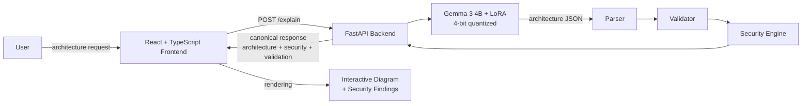

# CyberShield-Arch

Threat-aware AI architecture generator: converts natural-language system descriptions into interactive architecture diagrams with automated security gap analysis.

## Overview

CyberShield-Arch is a research-oriented application that turns a plain-language description of a software system into a structured architecture graph, renders it in an interactive editor, and automatically analyzes it for security weaknesses.

It exists to explore whether a small instruction-tuned model — a 4-bit Gemma 3 4B with a LoRA adapter, running on a single consumer laptop GPU — can produce valid, plausible architecture structures that a deterministic security engine can then assess for threats, missing controls, and overall risk.

Core workflow:

```
natural-language architecture request
        ↓
Gemma 3 4B LoRA (local inference)
        ↓
structured architecture JSON (nodes + edges)
        ↓
architecture validation
        ↓
interactive visualization
        ↓
automated security analysis
        ↓
threats · missing controls · risk · attack surface
```

## Key Features

- **AI architecture generation** — architecture graphs from plain-language prompts, inferred locally on CUDA.
- **Structured architecture output** — canonical JSON with typed nodes (`ui`, `service`, `database`, `cache`, `queue`, `container`) and labeled edges (`HTTP`, `DB Query`, `Async`, `Cache`).
- **Architecture validation** — model output is parsed, normalized, and checked against a runtime contract (node/edge limits, connectedness) with an automatic retry loop.
- **Interactive visualization** — React Flow-based editor: drag, connect, relabel, restyle, undo/redo, auto-layout, JSON import/export, and PNG export.
- **Automated security analysis** — a deterministic backend security engine analyzes each generated graph.
- **Threat and control-gap detection** — threats, missing security controls, risk level, security score, and attack surface per architecture.
- **Local-first inference** — no external API dependency; the model runs on your machine.

## System Architecture



## How It Works

1. **Request** — the frontend sends the user's description to `POST /explain` on the FastAPI backend.
2. **Inference** — the Gemma 3 4B LoRA model generates an architecture JSON document (nodes with types, edges with labels), with a bounded token budget and a retry loop for malformed or structurally weak output.
3. **Parsing** — raw model text is converted to the canonical graph contract: node types and edge labels are normalized against the project vocabulary, duplicates and self-loops are removed, and size limits are enforced.
4. **Validation** — the graph is checked for structural validity (connectedness, node/edge limits). Weak output triggers regeneration instead of reaching the user.
5. **Security analysis** — the deterministic security engine inspects the validated graph and produces findings (see Security Analysis below).
6. **Response** — the backend returns a single canonical response: `architecture`, `security`, `validation`, `metadata` (including inference duration), and the raw model output.
7. **Visualization** — the frontend renders the graph, marks threatened components, and displays the security posture and architecture details.

## AI Model

- **Base model:** `unsloth/gemma-3-4b-it-bnb-4bit` — Gemma 3 4B instruction-tuned, frozen during training.
- **Quantization:** 4-bit NF4 (BitsAndBytes) with bf16 compute, enabling inference on consumer GPUs.
- **Adapter:** LoRA (r=24, alpha=48, dropout 0.05, ~44.7 M trainable parameters) applied via PEFT.
- **Inference:** fully local on CUDA; the model is loaded once at backend startup and shared across requests.
- **Output target:** the model is trained to emit architecture JSON (nodes and edges) — not free-form prose.
- **Security is backend-computed:** the model does not generate security verdicts. All threat and risk analysis is produced by the backend security engine over the validated graph.

## Security Analysis

For every generated architecture, the backend security engine provides:

- **Threats** — named findings with severity and the missing control each threat maps to.
- **Risk level and security score** — an overall posture assessment (0–100 score with a risk classification).
- **Attack surface** — score plus counts of public endpoints, services, and databases in the graph.
- **Node- and edge-level findings** — per-component and per-connection threat details where available.
- **Recommendations and missing controls** — actionable gap reporting for the architecture.

The frontend renders this as a security panel (risk badge, score, threat lists, recommendations, missing controls) and marks affected nodes and connections directly on the diagram.

## Frontend

- **Stack:** React 18, TypeScript, Vite 5, React Flow, `dagre` layout, `lucide-react` and `simple-icons` (all local assets — no remote icon or font CDNs).
- **Workflow:** prompt input → explicit states (ready / generating / success / error) → rendered diagram with threat badges → security panel → architecture details panel (components, data flow, validation status, metadata).
- **Interaction:** node selection and editing, connect mode, undo/redo, auto-layout, theme toggle (dark default), JSON import/export, PNG export, and localStorage persistence of the last prompt and result.
- **Errors:** classified messages for backend-unreachable, invalid requests, generation failures, and malformed responses; generation is cancellable and duplicate submissions are blocked.
- **Verification:** the application was exercised end-to-end in a headless browser against the real backend (generation, states, security rendering, persistence, responsive layout, PNG export).

## Evaluation

Training setup (LoRA fine-tuning of the Gemma 3 4B base):

| Setting | Value |
|---|---|
| Training set | 46,348 records |
| Validation set | 2,575 records |
| Test set | 2,575 records (untouched) |
| Epochs | 1 |
| Train loss (final) | 0.2331 |
| Validation loss (final) | 0.1912 |
| Peak training VRAM | 3.53 GiB (RTX 4050 Laptop, ~5.66 GiB usable) |

Test-set results (greedy decoding, untouched test split):

| Metric | Value |
|---|---|
| Parse rate | 100% (2,575/2,575) |
| Contract-valid rate | 100% |
| Connected rate | 99.96% |
| Repetition failure rate | 0% |
| Node F1 | 0.224 |
| Edge F1 | 0.065 |
| Exact architecture match | 0% |

Two distinct findings must be separated:

- **Format and contract success:** the model reliably produces valid, well-formed, connected architecture structures — 100% parse rate, 100% contract validity, 99.96% connectedness, zero repetition failures.
- **Structural fidelity is limited:** the component inventory only partially matches the canonical target (node F1 0.224, edge F1 0.065, exact match 0%). Outputs are plausible and valid, but not faithful reproductions of a specified architecture.

## Limitations

- **Research/project-review prototype** — not production-ready, not state-of-the-art.
- **Low structural fidelity:** node F1 0.224, edge F1 0.065, exact match 0% — generated graphs are valid but only partially match the expected canonical inventory. Do not rely on the model to reproduce a specified architecture.
- **Validator-clean output does not imply a semantically correct architecture.**
- **0.04% of test outputs are disconnected**, covered at runtime by the retry loop.
- **Narrow domain coverage** — the training data covers a limited set of architecture styles; the dataset is small and purpose-built.
- **Hardware constraints** — inference runs on a single consumer laptop GPU (~5.66 GiB usable VRAM), with per-request generation in the tens of seconds.
- **Dataset redesign and retraining are planned future work** (see below).

## Installation / Running Locally

Prerequisites: Linux with an NVIDIA GPU and CUDA available to PyTorch, Python 3.10+ (3.12 recommended), Node.js 18+ and npm.

### 1. Python environment

```bash
python -m venv .venv
source .venv/bin/activate
pip install -r requirements.txt
```

The repository also ships `setup_env.sh`, which builds the same environment with `uv` and exports the recommended local cache paths.

Optional (recommended) local cache paths:

```bash
export HF_HOME=./.cache/huggingface
export TRANSFORMERS_CACHE=./.cache/huggingface
export TORCH_HOME=./.cache/torch
```

### 2. Start the backend

From the project root:

```bash
uvicorn backend.api.main:app --host 127.0.0.1 --port 8000
```

Model initialization happens at startup (weights load + a smoke inference). If `checkpoints/gemma_lora` is absent, the backend falls back to the base Gemma model. Health check: `GET http://127.0.0.1:8000/healthz`.

### 3. Start the frontend

In a second terminal:

```bash
cd frontend
npm install
npm run dev
```

Open the frontend at `http://localhost:5173`. The frontend targets the backend at `http://127.0.0.1:8000` by default; override with `VITE_API_URL` in `frontend/.env.local` if needed.

Production build:

```bash
cd frontend
npm run build
npm run preview
```

## Hugging Face Model

The trained LoRA adapter is published on Hugging Face:

**[CyberShield-Gemma-4B — https://huggingface.co/earnest-s/CyberShield-Gemma-4B](https://huggingface.co/earnest-s/CyberShield-Gemma-4B)**

A release package (adapter weights, `adapter_config.json`, and a model card) is also maintained under `release/huggingface/` in this repository.

## Project Status

The current release is a **research/project-review prototype**. The end-to-end system is functional — natural-language request through to validated architecture, security analysis, and interactive visualization — and the model reliably produces valid architecture structures. However, structural fidelity remains limited (see Evaluation and Limitations), and the current model should not be treated as a faithful architecture-reproduction engine.

## Future Work

- Dataset redesign (reduced naming arbitrariness, canonical representations).
- Improved structural representation and emission conventions.
- Retraining with the redesigned dataset.
- Improved node/edge fidelity.
- Explanation generation for generated architectures.
- Broader evaluation across more architecture domains and styles.
- Deployment optimization (quantization, serving, and startup time).