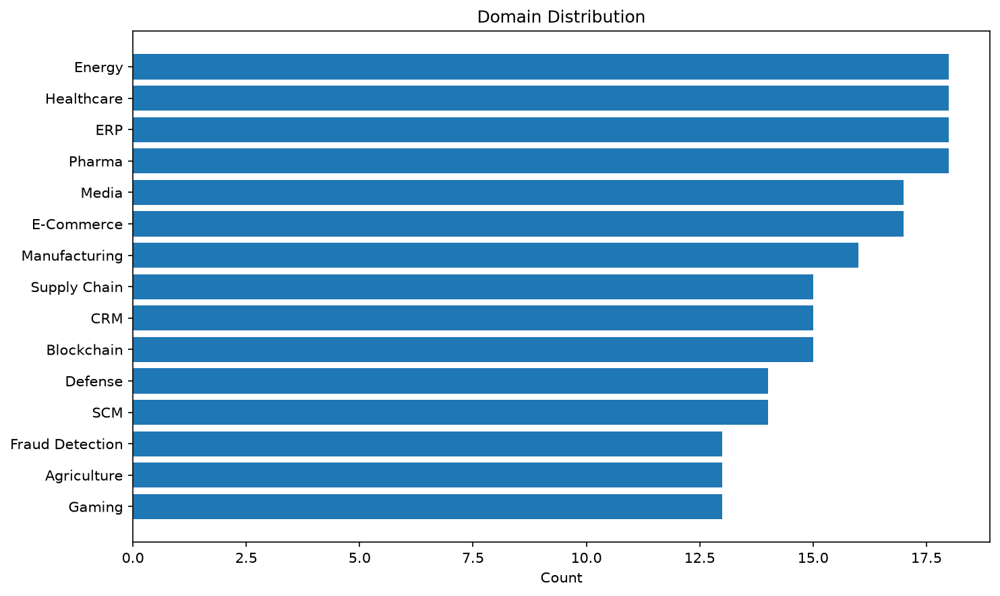
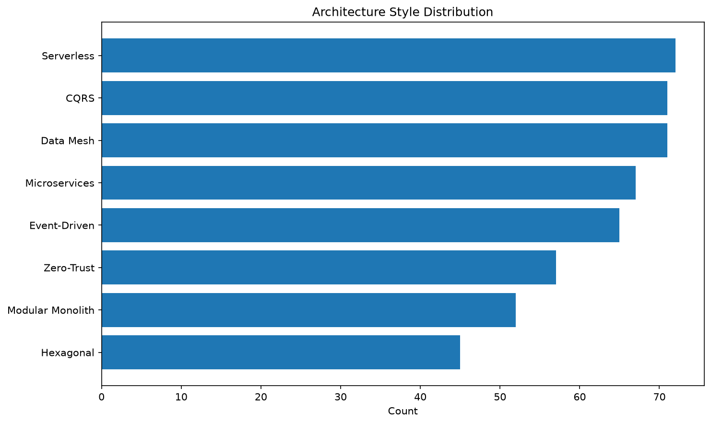
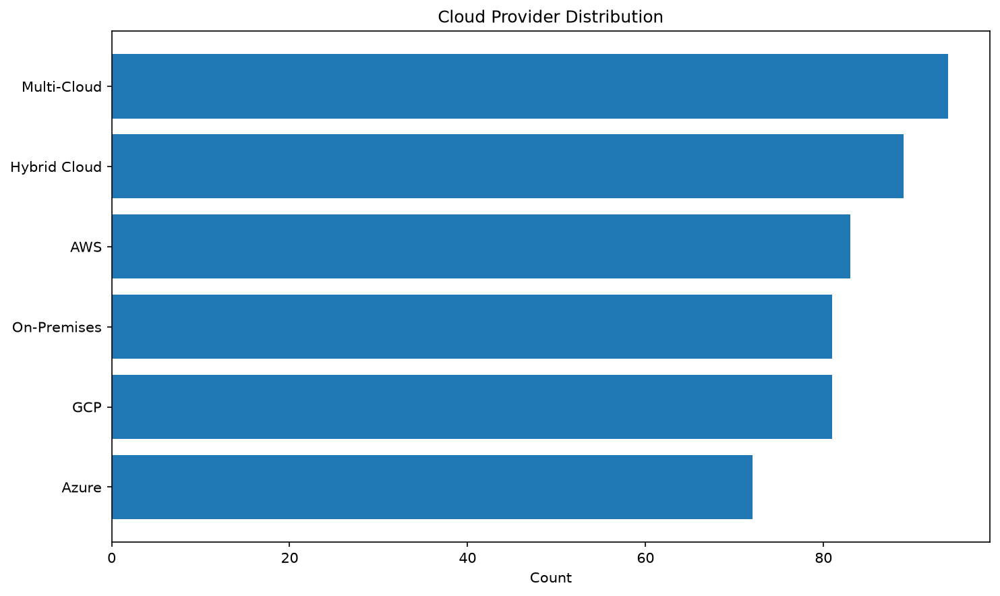
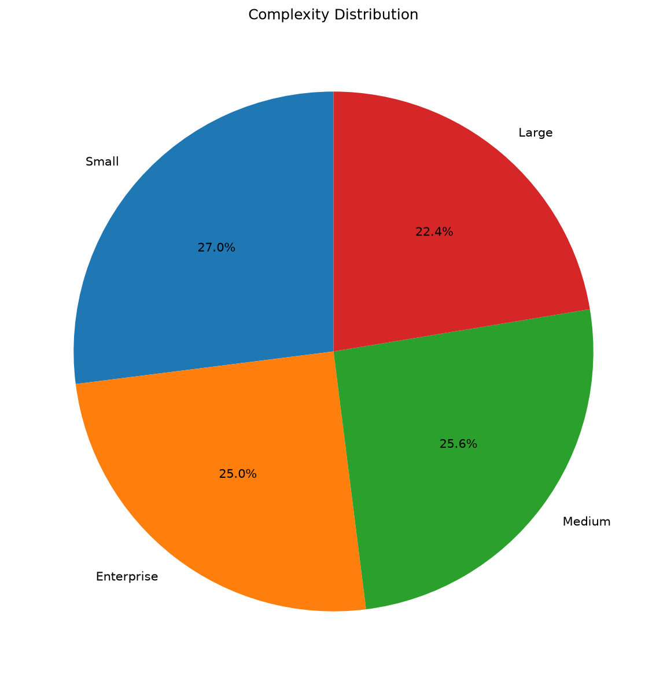
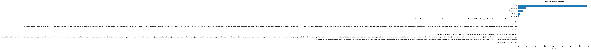
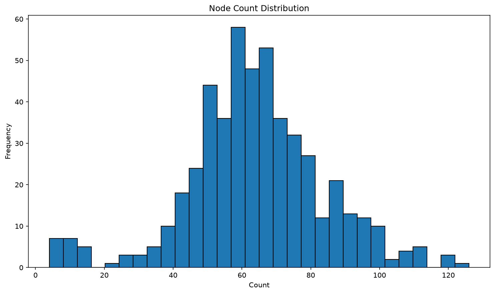
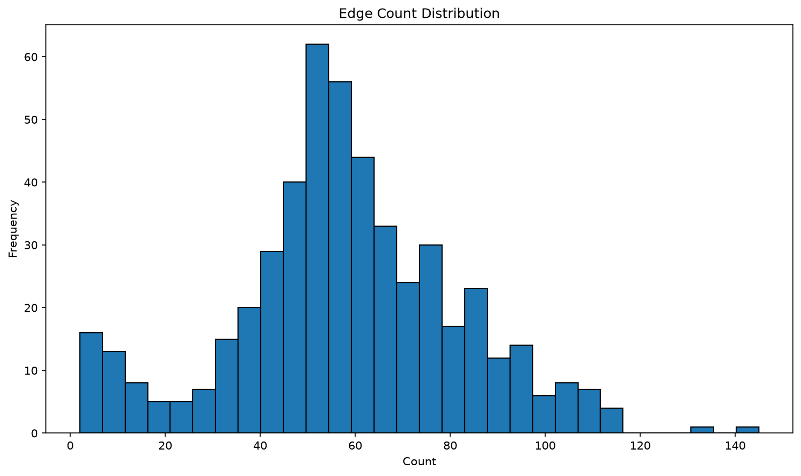

# Dataset Statistics

**Source:** ajibawa-2023/Technical-Architectures-Large
**Total Samples Analyzed:** 500

## Domain Distribution

- **Energy**: 18
- **Healthcare**: 18
- **ERP**: 18
- **Pharma**: 18
- **Media**: 17
- **E-Commerce**: 17
- **Manufacturing**: 16
- **Supply Chain**: 15
- **CRM**: 15
- **Blockchain**: 15
- **Defense**: 14
- **SCM**: 14
- **Fraud Detection**: 13
- **Agriculture**: 13
- **Gaming**: 13
- **Knowledge Graph**: 12
- **Cyber Security**: 12
- **Insurance**: 12
- **IoT**: 12
- **Oil & Gas**: 12
- **Warehouse**: 12
- **AIOps**: 12
- **DevSecOps**: 12
- **MLOps**: 11
- **FinTech**: 11
- **RAG**: 11
- **Retail**: 11
- **Telecom**: 10
- **Government**: 10
- **Smart City**: 10
- **HR**: 9
- **Education**: 9
- **Agentic AI**: 9
- **Autonomous Vehicles**: 9
- **Digital Twin**: 9
- **OTT**: 9
- **Logistics**: 8
- **Automotive**: 8
- **Travel**: 7
- **Multi-Agent Systems**: 7
- **Banking**: 6
- **GenAI**: 6

## Architecture Style Distribution

- **Serverless**: 72
- **CQRS**: 71
- **Data Mesh**: 71
- **Microservices**: 67
- **Event-Driven**: 65
- **Zero-Trust**: 57
- **Modular Monolith**: 52
- **Hexagonal**: 45

## Cloud Provider Distribution

- **Multi-Cloud**: 94
- **Hybrid Cloud**: 89
- **AWS**: 83
- **On-Premises**: 81
- **GCP**: 81
- **Azure**: 72

## Complexity Distribution

- **Small**: 135
- **Medium**: 128
- **Enterprise**: 125
- **Large**: 112

## Diagram Type Distribution

- **flowchart LR**: 391
- **graph LR**: 43
- **flowchart TB**: 30
- **graph TB**: 11
- **graph TD**: 2
- **We need to produce only mermaid code. Domain media; modular monolith; infrastructure GCP; small complexity; strict network segmentation; feature flags.**: 1
- **DR?**: 1
- **DR: ********: 1
- **We need to produce mermaid code only. Use appropriate diagram type. For event-driven architecture, maybe flowchart LR or TB. We need to show components: clients (Web UI, Mobile Apps, Admin Portal), network (CDN, WAF, API Gateway, Load Balancer), security (IAM, OIDC, MFA, Vault, KMS), compliance (ISO 27001), application (microservices, event bus, AI agents?), data (Lakehouse pattern: Data Lake + Warehouse, e.g., ADLS + Synapse), messaging (Kafka or Azure Event Hubs), AI/ML (embedding models, vector search?), observability (Prometheus, Grafana, Azure Monitor). DevOps/platform: Kubernetes (AKS) multi-cluster across two Azure regions (active-active). Auto scaling. Use service mesh (Istio). Use patterns: CQRS, Event Sourcing, Saga.**: 1
- **DR: DR ​**: 1
- **mermaid**: 1
- **We must produce only mermaid code. Use a suitable diagram type, likely flowchart LR or graph LR. Provide nodes grouped.**: 1
- **We need to produce only Mermaid diagram code. Use appropriate diagram type. For hexagonal architecture we may use flowchart. Let's use flowchart LR (left to right). Show components grouped: Client layer, Application (core domain) surrounded by adapters (driving and driven), infrastructure (AWS services). Show network segmentation with VPC subnets (Public, Private). Include load balancer, WAF, API gateway, CDN, etc. Show auto scaling groups, rate limiting via API gateway. Show security: IAM, Cognito, KMS. Data: RDS PostgreSQL, DynamoDB, ElastiCache (Redis), Elasticsearch. Messaging: SNS/SQS or Kafka? Use Amazon SQS. Observability: CloudWatch, X-Ray. CI/CD pipeline (CodePipeline). Include DevOps: EKS (Kubernetes) with Service Mesh (Istio). Use Auto Scaling groups.**: 1
- **We must output only mermaid code block with diagram. Use flowchart or graph. For hexagonal architecture (ports and adapters). Need small complexity but includes many components: clients, network, security, compliance, application, data, messaging, AI/ML, observability, devops/platform, cloud, patterns.**: 1
- **User wants only mermaid code.**: 1
- ****** ******: 1
- **Active-0**: 1
- **We must output only mermaid code. Use flowchart? Probably flowchart LR with subgraph grouping.**: 1
- **We must produce only mermaid code between triple backticks.**: 1
- **We must produce only mermaid code; no extra text. Use hexagonal architecture style with AWS infrastructure. Should have client layers, ports/adapters, core domain, etc. Include AI/ML inference integration. Observability stack. Rate limiting. Compliance/audit logging.**: 1
- **flowchart TD**: 1
- **auto ******: 1
- **This prompt says we need to output only mermaid code.**: 1
- **​**: 1
- **.**: 1
- **We must produce only mermaid code. Use a suitable diagram type. For architecture diagrams, flowchart LR or TB. Probably flowchart LR with subgraphs for zones. Must include components: client (Web UI, Mobile App, API consumers); network (CDN, WAF, firewall, VPN, API gateway, load balancer, edge network); security (IAM, OIDC, MFA, Vault, PKM? KMS, RBAC, Zero Trust). Compliance: PCI-DSS, GDPR etc. Application: microservices, event-driven, fraud detection engine, AI/ML models, LLM gateway maybe. Data: lakehouse (Delta Lake, Snowflake?), Postgres, Cosmos DB, Redis, Elasticsearch, Vector DB for embeddings. Messaging: Kafka. AI/ML: embedding models, vector search, RAG. Observability: Prometheus, Grafana, OpenTelemetry, ELK. DevOps: AKS (Kubernetes), Helm, GitOps, CI/CD. Cloud: Azure with regions. Disaster Recovery: geo-redundant storage, Azure Site Recovery.**: 1
- **We must produce only Mermaid diagram code. Should choose a diagram type; perhaps flowchart TB or LR. Use nodes for components: client (Web UI, Mobile App, Admin Portal), network (CDN, WAF, Firewall, VPN, API Gateway, Load Balancer), security (IAM, OAuth, MFA, Vault, KMS, RBAC), compliance (PCI-DSS etc). Application: microservices (HR Core, Payroll, Benefits, Recruiting, Performance), event-driven (Kafka), AI/ML (Embedding Model, Vector DB, GraphRAG). Data: PostgreSQL, MongoDB, Cassandra, Data Mesh nodes per domain (Employee Data Mesh, Payroll Data Mesh, etc). Messaging: Kafka. Observability: Prometheus, Grafana, OpenTelemetry, ELK. DevOps: Kubernetes multi-cluster, Istio service mesh, CI/CD. Cloud: AWS, Azure hybrid. Patterns: CQRS, Event Sourcing, Feature Flags, Rate Limiting.**: 1
- **We must produce only mermaid diagram code. Use appropriate diagram type; probably flowchart LR or TB. Need to reflect components: clients (Vehicle Edge Device, Fleet Management UI, API Consumers); network (CDN, WAF, firewall, VPN, API gateway, load balancer, edge network, etc.); security (IAM, OIDC, MFA, Vault, PKM? KMS, RBAC, etc). Compliance maybe none but could include ISO 26262 for automotive, but optional.**: 1

## Node Count Distribution

- **Mean**: 63.8
- **Median**: 62
- **Max**: 126 (sample id 209)
- **Min**: 4 (sample id 79)

## Edge Count Distribution

- **Mean**: 58.2
- **Median**: 57
- **Max**: 145
- **Min**: 2

## Largest Architecture

- **Sample ID**: 209
- **Domain**: Blockchain
- **Style**: Data Mesh
- **Nodes (source)**: 126
- **Edges (source)**: 88
- **Constraints**: ['Feature Flags', 'Active-Active Multi-Region', 'Compliance/Audit Logging']

## Smallest Architecture

- **Sample ID**: 79
- **Domain**: ERP
- **Style**: Zero-Trust
- **Nodes (source)**: 4
- **Edges (source)**: 3
- **Constraints**: ['High Throughput (100k+ TPS)', 'Rate Limiting', 'Disaster Recovery']
